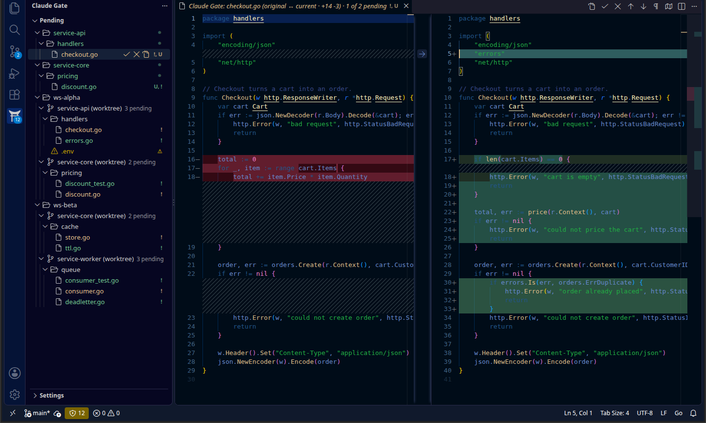

# Claude Gate

**Review every file Claude Code touches — accept or revert with one click.**

Stop flying blind when Claude modifies your codebase. Claude Gate captures every file change before it happens and surfaces each one as a structured diff — the same accept/reject workflow as Cursor's native AI review, but for Claude Code running in any terminal.

> **Note:** Claude Gate supports two modes: the **Claude Code terminal CLI** (`claude` command) via pre-installed hooks, and the **Claude Code VS Code/Cursor GUI extension** via automatic file change detection. GUI mode works best in "pure sessions" where Claude makes changes and you review before editing further — all file changes during a GUI session are captured for review.

---

## Screenshot



---

## Quick Start

Three steps, no manual config:

**1. Install**
Install **Claude Gate** from the VS Code / Cursor Extensions panel.

**2. Setup the hook**
Open the Command Palette (`Cmd+Shift+P` / `Ctrl+Shift+P`) and run:

```
Claude Gate: Setup Hook
```

This installs a `PreToolUse` hook into Claude Code that automatically snapshots files before Claude writes them.

**3. Run Claude Code normally**
Use `claude` in your terminal as usual. When Claude modifies files, Claude Gate shows a pending count badge in the sidebar — click any file to review the diff.

---

## The Review Flow

1. The **Claude Gate** icon in the Activity Bar shows three panels: **Pending**, **Accepted**, and **Rejected**
2. Click any pending file to open VS Code's native diff editor — original on the left, Claude's version on the right
3. **✓ Accept** and **✕ Reject** inline links appear at the top of the diff — one click, done
4. Accepted files move to the Accepted panel; rejected files are restored to their original content

### Reviewing with the keyboard

With a ClaudeGate diff focused, press **Cmd+Enter** to accept or **Cmd+Backspace** to reject the file; ClaudeGate then opens the next pending diff automatically (disable via `claudegate.autoAdvance`). Right-click any file row for Open File, Reveal in Explorer, Copy Path, and (with the Claude Context extension) Add to Claude Chat.

### Not seeing changes captured?

1. **Using Claude Code** (terminal or in-editor)? Make sure the hook is installed — run **`Claude Gate: Setup Hook`**. That covers all Claude Code edits.
2. **Using a non-Claude agent** (Cursor Composer, Codex) or still nothing showing? Enable the filesystem watcher: set `claudegate.fileWatcher.enabled` to `true` (or click **Enable file watcher** in the empty panel / the Settings pane).

---

## Features

- **Automatic session tracking** — hooks fire before every Claude file write; no manual start/stop
- **Pending / Accepted / Rejected panels** plus a **Settings pane** — per-panel collapse and view toggle, with settings (watcher, exclude patterns, hook status) managed right in the sidebar
- **Keyboard review** — `Cmd+Enter` accept / `Cmd+Backspace` reject the focused diff, then auto-advance to the next pending file
- **Change counts** — `+A -B` line counts in the diff tab title and pending-row tooltips
- **Exclude patterns** — `claudegate.exclude` globs (or a folder name) hide generated files from review, non-destructively
- **Group by session** — optionally group the panels by the Claude session that made each change, for parallel sessions in one workspace
- **Row file actions** — right-click for Open File, Reveal in Explorer, Copy Path, and Add to Claude Chat
- **Accept/Reject CodeLens** — inline action links at the top of any pending file, in the diff view and the regular editor
- **Folder-level actions** — accept or reject an entire directory at once (tree view mode)
- **Undo your decisions** — re-apply Claude's changes from the Rejected panel; un-accept files back to Pending
- **Workspace-aware filtering** — files modified outside the current workspace (e.g. `~/.claude/settings.json`) are hidden from the review panel
- **Pending count badge** on the sidebar panel header
- **Session history** archived to `~/.claudegate/history/`

---

## How It Works

```
Claude Code (terminal CLI)          Claude Code (VS Code GUI extension)
        │                                        │
  PreToolUse hook fires                 DocumentTracker watches
  hook.py snapshots original          file system for changes
        │                                        │
        └──────────────┬─────────────────────────┘
                       ▼
        ~/.claudegate/sessions/<workspace>.json
                       │
             Claude Gate review panels
```

The `PreToolUse` hook is the authoritative capture path for **all Claude Code — both the terminal CLI and the in-editor extension** (both run the same hook). The filesystem watcher is an optional fallback for **non-Claude** agents (Cursor Composer, Codex) and is off by default.

The hook captures a file's original content **once per session** — subsequent Claude writes to the same file don't overwrite the snapshot, so you always diff against the true before-state.

---

## Extension Settings

| Setting | Default | Description |
|---|---|---|
| `claudegate.fileWatcher.enabled` | `false` | Claude Code edits (terminal **and** in-editor) are captured by the `PreToolUse` hook, so this is **off by default**. Enable it only if you use a **non-Claude** agent (Cursor Composer, Codex) — the watcher can't attribute edits and may surface manual/formatter/git changes as false items. |
| `claudegate.exclude` | `{}` | Glob patterns (shaped like VS Code's `search.exclude`) whose matching files are hidden from review. Matching files are skipped by the watcher and hidden from the panel, counts, and badges even if the CLI hook captured them — nothing is deleted. Use `**/`-prefixed globs to match at any depth, or name a folder to exclude everything inside it. |
| `claudegate.groupBySession` | `false` | Group the review panels by the Claude Code **session** that produced each change — helpful when several sessions run in one workspace. Toggle it from the Settings pane too. Re-run **Setup Hook** so the hook records session ids. |

Example `settings.json`:

```jsonc
{
  // Terminal-CLI user: rely on the hook only.
  "claudegate.fileWatcher.enabled": false,
  // Hide generated files and whole folders from review.
  "claudegate.exclude": {
    "**/dist/**": true,
    "**/*.min.js": true,
    ".superpowers": true
  }
}
```

You can manage these from the **Settings** pane in the Claude Gate sidebar — toggle the file watcher, add/remove exclude patterns, and check hook status without editing `settings.json` by hand.

---

## Requirements

| Requirement                                  | Notes                                         |
| -------------------------------------------- | --------------------------------------------- |
| VS Code 1.85+ or Cursor                      |                                               |
| [Claude Code](https://claude.ai/claude-code) | Terminal CLI or VS Code/Cursor GUI extension  |
| Python 3.7+                                  | Pre-installed on macOS and most Linux distros |

> **Windows:** Native Windows is supported. Python must be on your `PATH` (`python` or `python3`). WSL is not required.

---

## Updating the Hook

After updating the extension, re-run **`Claude Gate: Setup Hook`** to install the latest hook script.

---

## Contributing & Issues

Found a bug or have a feature request? [Open an issue on GitHub](https://github.com/lntvan166/claudegate/issues).

---

## License

MIT — see [LICENSE](LICENSE)
